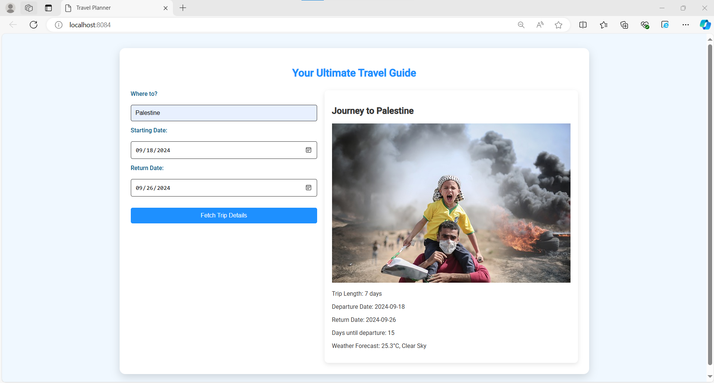

# Travel Planner
**Author: Haneen daoud **

This web application is designed to help users efficiently plan and manage their trips. It integrates various APIs to provide comprehensive travel information, including weather forecasts, location images, and more.

## Features

- **Location Data Retrieval**: Fetches detailed geographic information.
- **Weather Forecasting**: Provides weather updates specific to your trip.
- **Image Search**: Displays location images via the Pixabay API.
- **Trip Duration**: Calculates and displays the length of your trip.
- **Persistent Storage**: Saves trip details locally for easy access on return visits.

## Getting Started

### Prerequisites

- Node.js (version 16 or higher)

### Installation

1. **Clone the Repository**

    ```bash
    git clone https://github.com/haneen-daoud/travel-app_udacity-7.git
    cd travel-app
    ```

2. **Install Dependencies**

    ```bash
    npm install
    ```

### Development
- **Start the Server**

    ```bash
    npm start
    ```

- **Build for Development**

    ```bash
    npm run build
    ```

### Testing

- **Run Tests**

    ```bash
    npm run test
    ```

### Configuration

- **API Keys**: Ensure your API keys for GeoNames, Weatherbit, and Pixabay are correctly configured in the respective configuration files.

## Usage

1. Launch the application in your web browser.
2. Input a destination and travel dates to receive trip information.
3. Access weather forecasts, location images, and calculate trip duration.


## Acknowledgements

- **GeoNames API**
- **Weatherbit API**
- **Pixabay API**

## Preview

